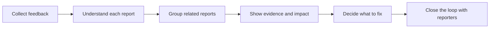
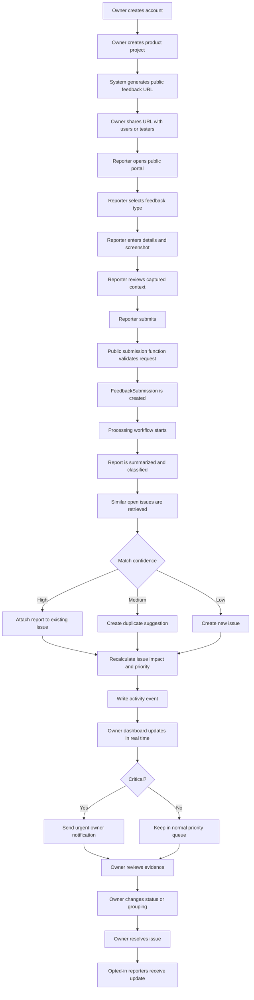
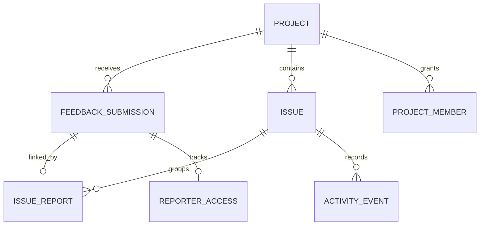
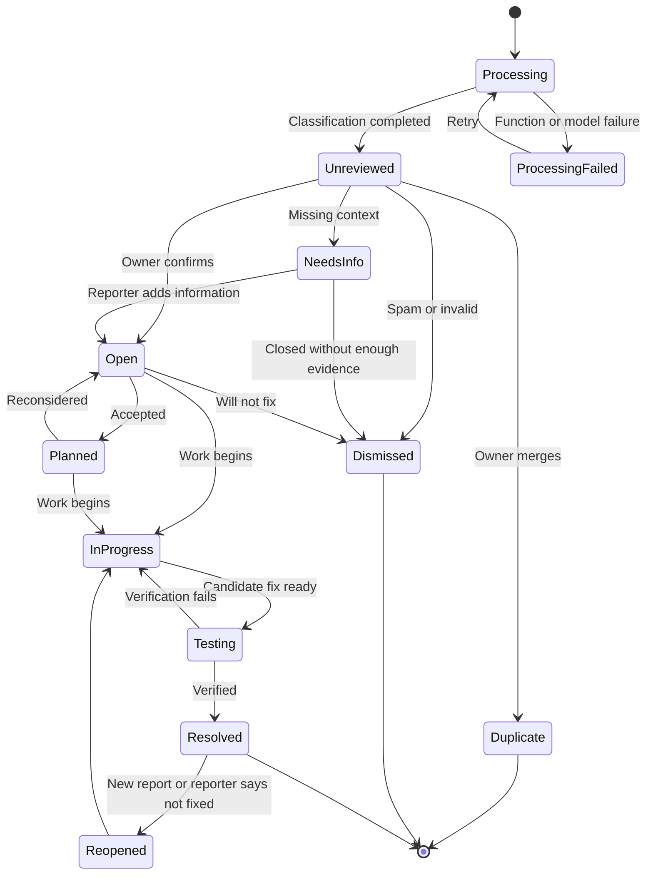
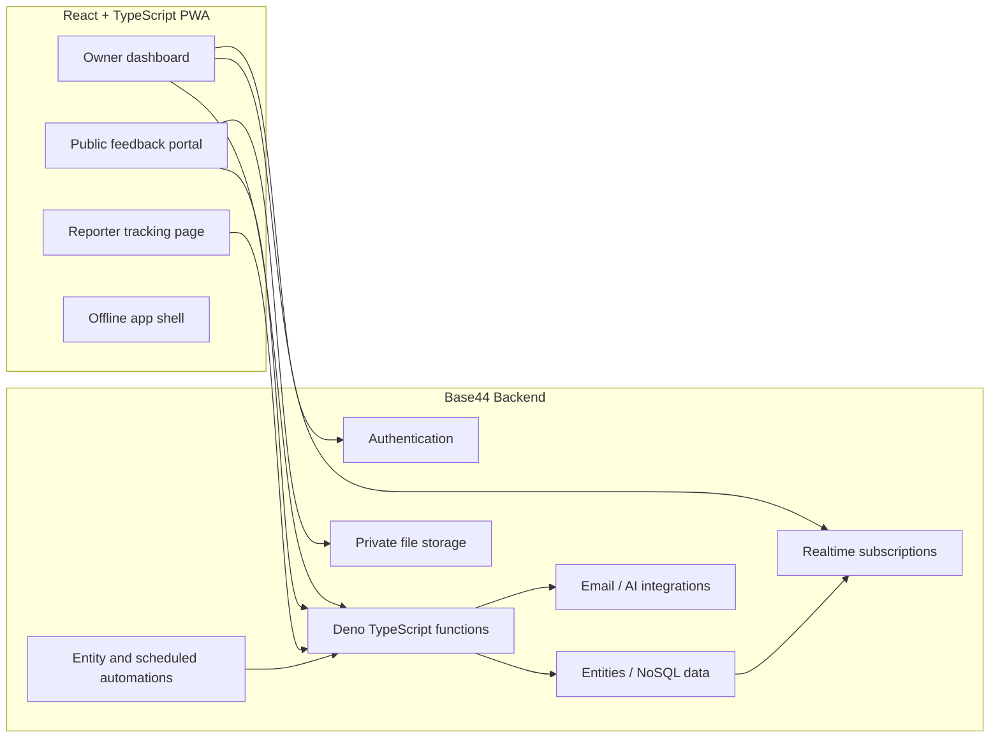
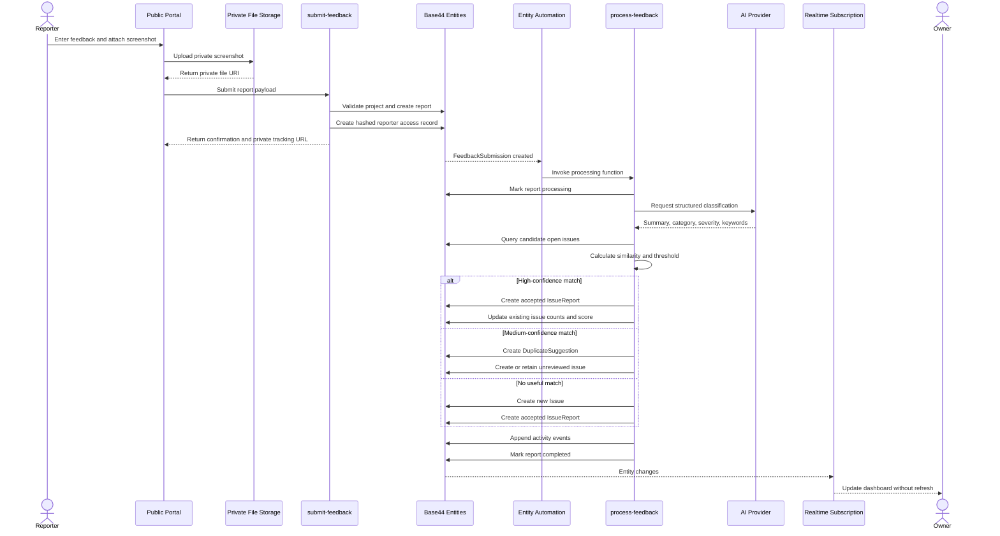
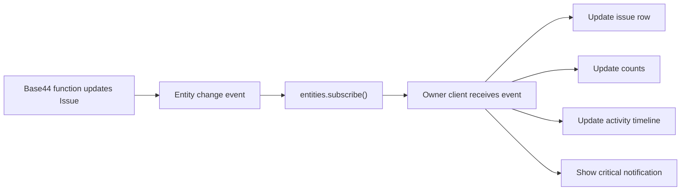
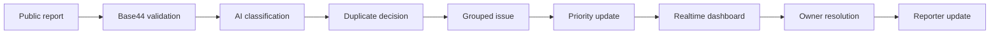

# Feedback Inbox
## Product, Features, End-to-End Flows, Base44 Backend, and Competition Setup

**Document:** 1 of 3  
**Status:** Competition working specification  
**Last verified:** July 22, 2026  
**Working product name:** Feedback Inbox

---

## 1. Product Summary

Feedback Inbox gives product teams one public link for collecting bug reports, feature requests, and general feedback.

Instead of leaving every response as an isolated form submission, the backend:

1. accepts text and screenshots;
2. captures useful device and page context with consent;
3. classifies the report;
4. finds similar open issues;
5. groups duplicate reports;
6. recalculates issue priority;
7. updates the owner dashboard in real time;
8. notifies the owner when an issue is critical; and
9. lets reporters privately track progress.

### One-sentence pitch

> One simple feedback link for users. One evidence-based inbox showing product teams what to fix next.

### Competition demo sentence

> Three users describe the same bug differently; the Base44 backend recognizes the relationship, groups the reports, raises the affected-user count and priority, and updates the dashboard live.

---

## 2. Why This Product Exists

Product feedback commonly arrives through direct messages, email, social comments, screenshots, group chats, support forms, internal notes, and verbal conversations.

The main problem is not merely collecting more feedback. The real problem is converting fragmented feedback into a trustworthy, prioritized issue queue.

Feedback Inbox is intentionally smaller than Jira, Linear, Productboard, Canny, or a complete support platform. It focuses on one workflow:



---

## 3. Primary Users

### 3.1 Product owner

A solo developer, startup founder, designer, product manager, or engineering lead who needs to understand user-reported problems.

The owner can:

- create a project;
- configure a public feedback portal;
- share a feedback link;
- review individual reports;
- review automatic duplicate suggestions;
- merge or separate reports;
- change issue priority and status;
- inspect screenshots and environment details;
- send public status updates; and
- resolve issues.

### 3.2 Reporter

A user, tester, customer, colleague, or beta participant who wants to report a problem or suggest an improvement.

The reporter can:

- submit feedback without creating an account;
- attach screenshots;
- review automatically captured context;
- optionally provide an email;
- receive a private tracking link;
- provide more information later; and
- confirm whether a resolution fixed the problem.

### 3.3 Team member — post-MVP

A collaborator invited by the project owner. Team collaboration is not required for the competition MVP, but the data model can retain a `ProjectMember` entity for future expansion.

---

## 4. Product Principles

1. **Submission must be fast.** A reporter should submit useful feedback in under one minute.
2. **AI must remain reviewable.** The app explains why reports were grouped.
3. **Original evidence must remain intact.** AI summaries never replace the source report.
4. **Privacy by default.** Screenshots and reporter details are not public.
5. **The owner stays in control.** Automatic grouping can be reversed.
6. **Priority must be explainable.** Show which factors increased the score.
7. **The dashboard must answer one question:** What needs attention now?
8. **No fake precision.** Similarity and severity are aids, not unquestionable truth.
9. **No giant project-management suite.** Keep the competition build focused.

---

## 5. MVP Scope

### 5.1 Must build

#### Owner experience

- Owner registration and authentication
- Create one or more product projects
- Configure public portal basics
- Copy public feedback URL
- Overview dashboard
- Feedback inbox
- Issue list
- Issue detail view
- Merge and unmerge report relationships
- Change issue status and priority
- Resolve issue with a public update
- Real-time dashboard changes

#### Reporter experience

- Public project feedback page
- Choose Bug, Feature request, or General feedback
- Enter description
- Add expected behavior for bugs
- Upload screenshot
- Review page/device/browser context
- Optional email
- Submit anonymously
- Confirmation page
- Private tracking link
- Add follow-up information
- View status updates

#### Backend behavior

- Validate public project slug
- Rate-limit public submissions
- Create secure report record
- Classify report type, product area, severity, and summary
- Find likely related open issues
- Automatically group high-confidence duplicates
- Flag medium-confidence matches for owner review
- Create a new issue when no strong match exists
- Recalculate priority
- Create an immutable activity event
- Publish real-time entity changes
- Send critical-owner notification
- Send reporter resolution notification when opted in

#### PWA and responsive behavior

- Responsive desktop and mobile layouts
- Installable web app manifest
- App-shell caching
- Draft preservation for an unfinished public report
- Recent owner-data caching
- Online/offline indicator
- Accessible mobile form controls

### 5.2 Explicitly postpone

- Public voting
- Public roadmap
- GitHub synchronization
- Jira or Linear synchronization
- Slack integration
- Native screen recording
- Custom domains
- Multi-level team permissions
- Billing
- AI-generated code fixes
- Full customer-support ticketing
- Full analytics suite
- Multiple organizations and enterprise administration

---

## 6. End-to-End Product Flow



---

## 7. Report and Issue Model

The product deliberately separates a **report** from an **issue**.

### Report

One person’s original submission.

> “My outgoing chat message appears in the middle of the page with too much empty space.”

### Issue

The normalized product problem that may contain many reports.

> “Outgoing chat container uses incorrect width on mobile Safari.”



---

## 8. Issue Lifecycle



---

## 9. Base44 Architecture

Base44 is the complete managed backend. The frontend is a React PWA.



### Base44 responsibilities

| Requirement | Base44 capability |
|---|---|
| Owner signup and sessions | Authentication |
| Project, report, issue, and event data | Entities |
| Public submission validation | Backend function |
| Screenshot storage | Private file upload |
| Classification | Backend function + AI provider |
| Duplicate matching | Backend function |
| Automatic processing | Entity automation |
| Critical alerts | Email integration |
| Daily digest | Scheduled automation |
| Live dashboard | Entity subscriptions |
| Per-project access | Row/field security |
| Elevated internal processing | Service role in hosted functions |
| Deployment | CLI and hosting |

---

## 10. Recommended Repository Structure

```text
feedback-inbox/
├── src/
│   ├── app/
│   ├── api/base44Client.ts
│   ├── components/
│   ├── features/
│   ├── pages/
│   ├── hooks/
│   ├── lib/
│   ├── styles/
│   └── main.tsx
├── public/
│   ├── icons/
│   ├── manifest.webmanifest
│   └── offline.html
├── base44/
│   ├── .app.jsonc
│   ├── config.jsonc
│   ├── .types/types.d.ts
│   ├── auth/config.jsonc
│   ├── entities/
│   │   ├── project.jsonc
│   │   ├── project-member.jsonc
│   │   ├── feedback-submission.jsonc
│   │   ├── issue.jsonc
│   │   ├── issue-report.jsonc
│   │   ├── duplicate-suggestion.jsonc
│   │   ├── activity-event.jsonc
│   │   └── reporter-access.jsonc
│   └── functions/
│       ├── submit-feedback/
│       ├── process-feedback/
│       ├── review-grouping/
│       ├── update-issue-status/
│       ├── access-tracking-page/
│       ├── add-reporter-follow-up/
│       ├── send-critical-alert/
│       └── send-daily-digest/
├── package.json
├── vite.config.ts
└── README.md
```

---

## 11. Base44 Entity Plan

Entity property names below are a starting contract. Confirm exact JSONC security syntax against the installed Base44 skills and current documentation while implementing.

### 11.1 `Project`

```text
id
ownerId
name
slug
productUrl
description
logoFileUri
allowAnonymous
collectReporterEmail
notifyReporterOnResolution
isActive
createdAt
updatedAt
```

### 11.2 `ProjectMember`

```text
projectId
userId
role: owner | editor | viewer
status: invited | active | removed
createdAt
```

### 11.3 `FeedbackSubmission`

```text
projectId
type: bug | feature | general
description
expectedBehavior
reproductionSteps
pageUrl
reporterEmail
reporterEmailHash
browserName
browserVersion
operatingSystem
deviceType
screenWidth
screenHeight
attachmentFileUris[]
processingStatus: pending | processing | completed | failed
aiSummary
aiCategory
aiProductArea
aiSeverity
aiKeywords[]
aiConfidence
createdAt
updatedAt
```

Rules:

- Preserve original user text.
- Never replace `description` with `aiSummary`.
- Keep email hidden from ordinary project viewers if future roles require it.
- Store attachment references, not permanent public URLs.

### 11.4 `Issue`

```text
projectId
publicCode
title
description
category
productArea
severity: critical | high | medium | low
priorityScore
priorityExplanation[]
status
reportCount
affectedUserCount
assigneeId
firstSeenAt
lastSeenAt
resolvedAt
publicResolutionNote
createdAt
updatedAt
```

**Public issue identity.** Do not implement per-project atomic counters for the
competition MVP. Sequential IDs such as `FI-104` introduce unnecessary
concurrency work under the concurrent-submission demo.

```text
Internal identity:   Base44 built-in entity ID (used for all relationships)
Public issue code:   FI- followed by 6 uppercase Crockford Base32 characters
Example:             FI-7K2M9A
```

Generate the public code inside the backend function (six uppercase Crockford
Base32 characters), check for collision within the project before creating the
issue, and store it in `publicCode`. All entity relationships continue to use
Base44's built-in record ID. See `docs/04_technical_decisions.md` for the exact
generation rule.

### 11.5 `IssueReport`

```text
projectId
issueId
submissionId
similarityScore
matchingReasons[]
groupingMethod: automatic | suggested | manual
reviewStatus: accepted | pending | rejected
createdAt
```

### 11.6 `DuplicateSuggestion`

```text
projectId
submissionId
candidateIssueId
similarityScore
matchingReasons[]
status: pending | accepted | rejected
reviewedBy
reviewedAt
createdAt
```

### 11.7 `ActivityEvent`

Append-only history.

```text
projectId
issueId
submissionId
eventType
actorType: reporter | owner | system
actorId
publicMessage
internalMessage
metadata
createdAt
```

Suggested events:

- `feedback_received`
- `classification_completed`
- `duplicate_auto_grouped`
- `duplicate_suggested`
- `duplicate_accepted`
- `priority_changed`
- `status_changed`
- `reporter_follow_up`
- `issue_resolved`
- `issue_reopened`

### 11.8 `ReporterAccess`

```text
submissionId
projectId
tokenHash
expiresAt
emailUpdatesEnabled
lastAccessedAt
createdAt
```

Return the raw token once to the reporter and save only its hash.

---

## 12. Backend Functions

### 12.1 `submit-feedback`

Public entry point.

Responsibilities:

1. validate project slug;
2. validate feedback type and length;
3. validate attachment references;
4. sanitize text;
5. enforce rate limits and basic abuse controls;
6. create `FeedbackSubmission`;
7. create a private reporter access token;
8. write `feedback_received` event; and
9. return confirmation and tracking URL.

The browser should not have unrestricted public write access to all report records.

### 12.2 `process-feedback`

Triggered after a new submission is created in production.

Responsibilities:

1. acquire a processing lock;
2. mark report as processing;
3. create structured classification;
4. retrieve candidate issues;
5. score similarity;
6. auto-group, suggest, or create;
7. recalculate priority;
8. write activity events;
9. mark processing complete; and
10. dispatch critical notification if required.

The function must be idempotent. Re-running it should not create duplicate links or inflate report counts.

### 12.3 `review-grouping`

Authenticated owner action:

- verify project membership;
- accept or reject a duplicate suggestion;
- move a report between issues;
- ungroup a report;
- recalculate affected issues; and
- record activity.

### 12.4 `update-issue-status`

Authenticated owner action:

- verify project membership;
- validate status transition;
- update issue;
- create activity event; and
- send reporter update when appropriate.

### 12.5 `access-tracking-page`

Public token-based read function:

- hash supplied token;
- find active `ReporterAccess`;
- return only safe public fields; and
- hide internal notes and other reporter identities.

### 12.6 `add-reporter-follow-up`

Token-based write function:

- validate tracking token;
- add follow-up text or attachment;
- create activity event; and
- potentially reopen the issue or notify the owner.

### 12.7 `send-critical-alert`

- create a concise alert;
- send email to project owner; and
- avoid duplicate notifications for the same escalation window.

### 12.8 `send-daily-digest`

- summarize new reports;
- list critical and high-priority issues;
- show pending duplicate suggestions; and
- avoid sending an empty digest unless configured.

---

## 13. Feedback Processing Sequence



---

## 14. Duplicate Matching Strategy

### Step 1: Candidate filtering

Retrieve issues where:

- `projectId` matches;
- status is not terminal, or was resolved recently;
- category or product area is compatible; and
- last activity is within a reasonable time window.

### Step 2: Deterministic signals

- normalized title-term overlap;
- same page path;
- same product area;
- same device class;
- same browser;
- common error text; and
- same expected behavior.

### Step 3: Semantic or LLM comparison

```json
{
  "same_underlying_issue": true,
  "confidence": 0.91,
  "reasons": [
    "same product area",
    "same mobile layout symptom",
    "same page path"
  ]
}
```

### Step 4: Initial thresholds

```text
0.85–1.00  Automatically group
0.65–0.84  Suggest possible duplicate
0.00–0.64  Keep separate or create new issue
```

Store the threshold version in processing metadata.

### Step 5: Reversibility

An owner can merge, separate, reject, choose another canonical issue, and inspect the explanation.

---

## 15. Priority Scoring

The priority formula is **locked** for the MVP. It is deterministic and reproducible in code.

```text
priorityScore = min(
  severityWeight
  + frequencyWeight
  + reproducibilityWeight
  + rapidSpikeWeight
  + recentActivityWeight
  + coreWorkflowWeight
  + reopenedWeight,
  100
)
```

Weights:

```text
Severity:
critical = 50
high = 30
medium = 15
low = 5

Frequency:
(reportCount - 1) × 5, capped at 25

Reproducibility:
confirmed = 10
likely = 5
unknown = 0

Rapid spike:
+8 when at least 3 reports arrive within 60 minutes

Recent activity:
+5 when lastSeenAt is within 24 hours

Core workflow blocked:
+15

Previously resolved issue reopened:
+12
```

Worked example (reproducible from the weights above):

```text
High severity        30
Six reports          25   ((6 - 1) × 5, capped at 25)
Confirmed reproducible  10
Rapid spike           8
Recent activity       5
Total                78
```

Example explanation string:

> Priority 78: High severity (+30), six reports (+25), confirmed reproducible (+10), rapid spike (+8), recent activity (+5).

Store the contributing factors in `priorityExplanation[]` so the score is always explainable.

---

## 16. Realtime Data Flow



Subscribe only to project-scoped data available under the current user’s permissions.

---

## 17. File Upload and Screenshot Privacy

### Recommended default

Use private file storage for screenshots.

Store:

- private `file_uri`;
- MIME type;
- size;
- width and height when available;
- uploader context; and
- relationship to report.

Generate short-lived signed URLs only when an authorized owner opens an attachment.

### AI screenshot analysis

The documented built-in structured extraction workflow begins with a public `UploadFile` URL. Therefore:

- do not automatically make user screenshots public merely to simplify extraction;
- test whether a private signed URL works safely with the chosen model path;
- otherwise call an external vision model from a protected backend function with a short-lived signed URL; and
- for the MVP, screenshot analysis can be optional while text classification remains complete.

### Reporter disclosure

Show what is attached:

```text
Browser: Safari 18
Device: iPhone
Screen: 390 × 844
Page: /chat
```

The reporter must be able to remove optional context.

---

## 18. Security Model

### Owner-facing records

Only a project owner or active project member may read:

- full submissions;
- issue records;
- screenshots;
- reporter emails;
- internal notes; and
- activity metadata.

### Reporter-facing records

A reporter may view only a safe projection through a valid tracking token:

- their original summary;
- public issue title;
- public status;
- public updates; and
- requests for more information.

### Public access

Public visitors may:

- read minimal public project branding by slug;
- call `submit-feedback`; and
- call tracking functions with a valid token.

They may not list submissions or issues.

### Service role

Use the Base44 service role only in hosted backend functions. Every such function must re-check project ownership, allowed action, record relationship, request limits, and sensitive-field exposure.

### Additional controls

- Rate limiting by project and source
- Maximum text and file size
- MIME allowlist
- Sanitized filenames
- Spam honeypot
- Duplicate-submit idempotency key
- Append-only activity events
- No secrets in frontend code
- No permanent signed URLs

---

## 19. PWA Architecture

The React frontend handles:

- web app manifest;
- icons;
- service worker;
- app-shell caching;
- offline page;
- update prompt;
- draft storage; and
- retry queue for safe client actions.

### Offline support for reporters

- Preserve an unfinished report locally.
- Do not claim successful submission while offline.
- Let the user retry once connected.
- Keep screenshot blobs locally only as long as needed.

### Offline support for owners

- Cache recently viewed issue summaries.
- Clearly label cached data.
- Avoid blindly queueing status transitions that may conflict.

---

## 20. Base44 Setup

### Prerequisites

- Node.js 20.19.0 or newer
- npm
- Git
- Base44 account
- Deno installed for local backend function execution
- Competition registration completed

### Option A — Base44 React template

```bash
npx base44@latest create
```

Choose the React/Vite template when prompted.

### Option B — Add Base44 to an existing Vite project

```bash
npm create vite@latest feedback-inbox -- --template react-ts
cd feedback-inbox
npm install
npm install -g base44@latest
base44 create
npm install @base44/sdk
```

Choose **Create a basic project** when prompted.

### Configure `base44/config.jsonc`

```jsonc
{
  "name": "feedback-inbox",
  "description": "Evidence-based product feedback inbox",
  "site": {
    "outputDirectory": "dist",
    "serveCommand": "npm run dev"
  }
}
```

### Create SDK client

Read the app ID from `base44/.app.jsonc`.

```ts
import { createClient } from "@base44/sdk";

export const base44 = createClient({
  appId: "YOUR_BASE44_APP_ID"
});
```

### Define and push entities

Place schemas under `base44/entities/`.

```bash
base44 entities push
base44 types generate
```

### Run locally

```bash
base44 dev
```

Important local behavior:

- entities use an in-memory local database;
- local data clears when the dev server stops;
- functions reload locally;
- file uploads run locally;
- email/password auth can run locally;
- realtime subscriptions work locally; and
- entity and scheduled automations do **not** run locally.

Test processing by calling the function directly during local development, then deploy to verify the real automation trigger.

### Build and deploy

```bash
npm run build
base44 deploy
```

Before submission:

```bash
base44 entities push
base44 types generate
npm run typecheck
npm run build
base44 deploy
```

Use the exact scripts available in the generated project.

---

## 21. Environment and Secrets

Store server-only secrets in Base44 backend configuration, never in Vite client environment variables.

Possible secrets:

- AI provider API key
- Email provider configuration if not using built-in email
- Optional error-monitoring key
- Optional CAPTCHA secret

---

## 22. Development Stages

### Stage 0 — Foundation

- Create fresh Base44 competition project.
- Configure React, TypeScript, styles, router, and Base44 client.
- Push first entity schemas.
- Verify owner authentication.

**Exit condition:** Owner can sign in and create a project record.

### Stage 1 — Public submission

- Public project lookup by slug
- Reporter form
- Private screenshot upload
- `submit-feedback`
- Confirmation and tracking token

**Exit condition:** Anonymous reporter submits a report safely.

### Stage 2 — Issue creation

- `process-feedback`
- Create issue
- Link report
- Activity event
- Owner inbox

**Exit condition:** A report becomes a visible issue.

### Stage 3 — Duplicate intelligence

- Candidate filtering
- Similarity output
- Auto-group threshold
- Duplicate-review UI
- Merge and unmerge

**Exit condition:** Three related reports group into one issue and can be separated.

### Stage 4 — Realtime and notifications

- Realtime subscriptions
- Live counts
- Critical alert
- Status-change reporter email

**Exit condition:** Two browser windows update during the demo.

### Stage 5 — Design and PWA

- Final design system
- Responsive public form
- Responsive owner dashboard
- Manifest and installability
- Loading, empty, error, and offline states

### Stage 6 — Demo reliability

- Seed demo project
- Seed related and unrelated reports
- Add a safe demo scenario
- Verify timeline
- Test retry states
- Record submission video

---

## 23. Competition Demo Script

1. Show an owner dashboard with no urgent issues.
2. Reporter A submits: “My outgoing chat bubble is centered and leaves too much empty space on iPhone.”
3. A new issue appears.
4. Reporter B submits: “Messages do not use the screen width in mobile Safari.”
5. The backend groups it with the first issue.
6. Reporter C submits: “Chat layout looks broken after the latest update.”
7. The issue count and priority increase.
8. Open issue detail and show original reports, screenshots, grouping reasons, environment overlap, confidence, and timeline.
9. Owner resolves the issue with a public note.
10. Reporter tracking page updates.

---

## 24. Acceptance Criteria

### Public submission

- Valid slug loads correct branding.
- Invalid or inactive slug returns a clear error.
- Submission cannot create arbitrary project records.
- Files are validated.
- Reporter receives a tracking link.
- Refreshing does not duplicate submission.

### Processing

- Function is idempotent.
- Original text is preserved.
- High-confidence duplicates attach correctly.
- Medium-confidence cases appear for review.
- Unrelated reports remain separate.
- Failure is visible and retryable.

### Security

- Owner A cannot read Owner B’s projects.
- Reporter token A cannot access report B.
- Internal notes never appear on tracking page.
- Screenshot URLs expire.
- Public users cannot list reports.

### Realtime

- New issue appears without refresh.
- Report count increments without refresh.
- Status change reaches tracking page.
- Subscription reconnects after temporary loss.

### UX

- Reporter can submit comfortably on a phone.
- Owner finds highest-priority issue within five seconds.
- Grouping explanation is visible.
- Empty and error states are designed.
- Keyboard and screen-reader navigation are supported.

---

## 25. Risks and Mitigations

| Risk | Mitigation |
|---|---|
| AI groups unrelated reports | Medium-confidence review queue and unmerge |
| AI misses duplicates | Manual merge and better candidate retrieval |
| Screenshot privacy | Private files and short-lived signed URLs |
| Public endpoint spam | Rate limits, honeypot, size limits, optional CAPTCHA |
| Automations cannot be tested locally | Direct local function calls plus deployed tests |
| Scope becomes Jira-like | Keep MVP to feedback-to-issue workflow |
| Demo depends on unpredictable model output | Seed reports and constrained structured prompts |
| Priority feels arbitrary | Show factor-by-factor explanation |
| Reporter tracking link leaks | Hash token, allow expiry and revocation |

---

## 26. Success Metrics

### Competition

- End-to-end report processing works.
- Three duplicate reports reliably group.
- Dashboard updates in real time.
- Owner can reverse a grouping.
- Critical alert sends.
- Reporter can track resolution.
- Demo completes in under three minutes.

### Post-competition

- Median time to submit
- Percentage reviewed
- Duplicate-suggestion acceptance rate
- Time from report to owner review
- Affected users per resolved issue
- Reporter resolution-confirmation rate

---

## 27. Official Base44 References

- [Base44 Developer Platform](https://docs.base44.com/developers/home)
- [React Quickstart](https://docs.base44.com/developers/backend/quickstart/frameworks/quickstart-with-react)
- [Backend Features](https://docs.base44.com/developers/backend/overview/features)
- [Project Structure](https://docs.base44.com/developers/backend/overview/project-structure)
- [Local Development](https://docs.base44.com/developers/backend/overview/local-dev/local-development-overview)
- [SDK Data Operations](https://docs.base44.com/developers/references/sdk/getting-started/work-with-data)
- [SDK Integrations and File Uploads](https://docs.base44.com/developers/references/sdk/docs/type-aliases/integrations)
- [CLI Overview](https://docs.base44.com/developers/references/cli/get-started/overview)
- [Dev Build-Off](https://backendcompetition.base44.app/)
- [Dev Build-Off Terms](https://backendcompetition.base44.app/terms)

---

## 28. Final Scope Lock



Anything that does not materially strengthen that chain should be deferred.
