# VensaOS
## End-to-End UI/UX Flows and Competition Build Blueprint

**Document:** 3 of 3  
**Status:** Screen and interaction specification  
**Last updated:** July 22, 2026

---

## 1. Purpose of This Document

This document translates the product and design direction into:

- information architecture;
- routes;
- screen-by-screen flows;
- responsive behavior;
- component states;
- Mermaid diagrams;
- acceptance criteria; and
- an implementation order for the competition.

Use it together with:

1. `01_product_backend.md`
2. `02_design_references.md`

---

## 2. Experience Map

There are three connected experiences:

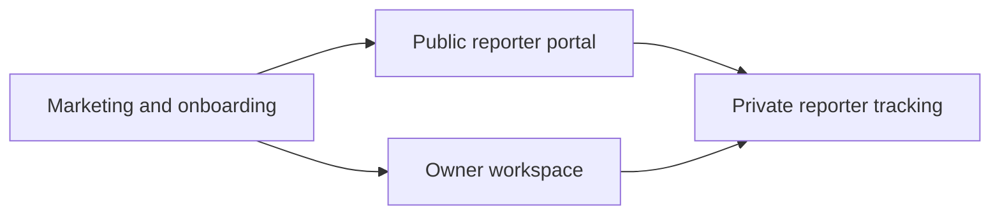

### Owner workspace

Authenticated:

- Overview
- Inbox
- Issues
- Issue detail
- Resolved
- Project settings

### Public reporter portal

No account required:

- Select feedback type
- Submit report
- Confirmation

### Reporter tracking

Private token link:

- View status
- Read public updates
- Provide more information
- Confirm resolution

---

## 3. Route Map

```text
/
├── /demo
├── /login
├── /signup
├── /onboarding
│   ├── /project
│   ├── /feedback-settings
│   └── /share
├── /app
│   ├── /overview
│   ├── /inbox
│   ├── /issues
│   ├── /issues/:issueId
│   ├── /resolved
│   └── /settings
│       ├── /general
│       ├── /portal
│       └── /notifications
├── /f/:projectSlug
│   ├── /bug
│   ├── /feature
│   ├── /general
│   └── /submitted/:submissionId
└── /track/:token
```

Route behavior:

- `/f/:projectSlug` is public.
- `/track/:token` is public but token-protected.
- `/app/*` requires owner authentication.
- Preserve the intended owner route through authentication.
- Invalid public slug uses a branded not-found state, not the owner 404 page.

---

## 4. Information Architecture

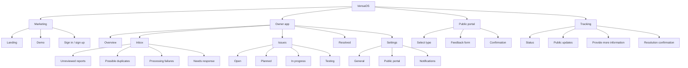

---

## 5. New Owner Onboarding

### Goal

Create a usable feedback portal in under two minutes.

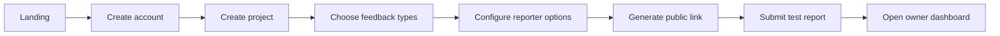

### Screen 5.1 — Landing

**Primary goal:** Explain the transformation from raw feedback to prioritized issues.

Content:

- Hero
- Three-report-to-one-issue visual
- How it works
- Evidence preview
- Public-form preview
- CTA

Primary CTA:

`Create a feedback board`

Secondary CTA:

`View demo`

### Screen 5.2 — Sign up

Use Base44 authentication.

Keep the page minimal:

- Logo
- One sentence
- Authentication control
- Link to sign in

Do not request product details on this screen.

### Screen 5.3 — Create project

Fields:

- Product name
- Product URL
- Product type
- Short description
- Optional logo

Validation:

- Required name
- Valid URL when present
- Slug availability
- Logo MIME and size

Primary action:

`Continue`

### Screen 5.4 — Choose feedback types

Three toggles selected by default:

- Bug reports
- Feature requests
- General feedback

Optional categories can be added later in settings.

### Screen 5.5 — Reporter options

Options:

- Allow anonymous feedback
- Ask for email
- Let reporters receive updates
- Collect page URL
- Collect browser and device context
- Allow screenshots

Use explanatory text beside each option.

### Screen 5.6 — Share portal

Show:

- Public link
- Copy action
- Open portal
- Submit a test report

The recommended next action is `Submit a test report`, not “Go to dashboard.”

### Onboarding acceptance criteria

- Browser back preserves entered values.
- Refresh after project creation does not create a duplicate.
- Owner can skip logo.
- Generated link is usable immediately.
- Test submission appears in the dashboard.

---

## 6. Public Reporter Flow

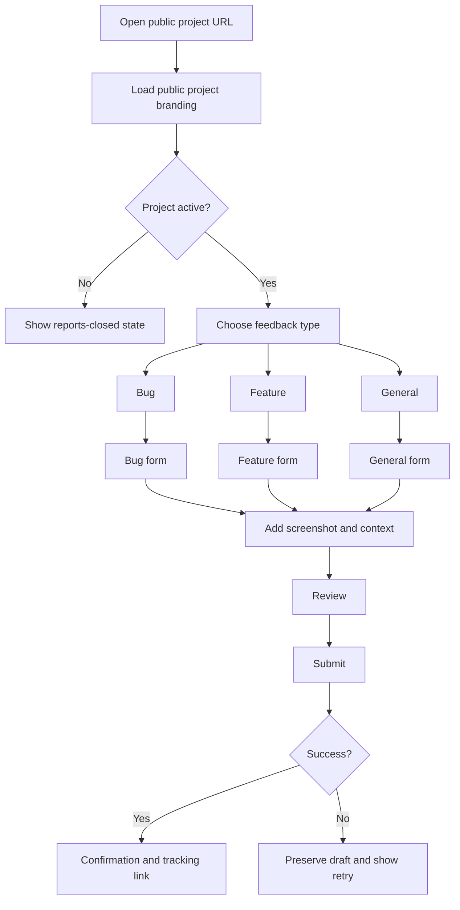

### Screen 6.1 — Public portal entry

Header:

- Product logo
- Product name
- Optional product link

Copy:

> Help us improve [Product]. Report a problem or share an idea. It usually takes less than a minute.

Feedback-type cards:

1. Report a problem
2. Suggest an improvement
3. Share general feedback

Each includes one supporting sentence.

### Screen 6.2 — Bug form

Start with:

**What happened?**

Fields shown initially:

- Description
- Screenshot

Progressively reveal:

- What did you expect?
- Can you reproduce it?
- Page URL
- Optional email

Do not force a multi-step wizard unless mobile testing proves it reduces friction.

### Screen 6.3 — Feature-request form

Questions:

- What would you like to do?
- Why would this be useful?
- How do you handle it today? — optional
- Screenshot or mockup — optional
- Email — optional

### Screen 6.4 — General-feedback form

Questions:

- What would you like us to know?
- Screenshot — optional
- Email — optional

### Screen 6.5 — Attachment flow

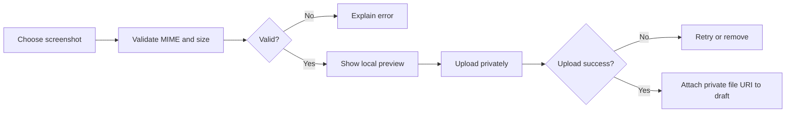

States:

- Empty
- Drag active
- Preview
- Uploading
- Uploaded
- Failed
- Removed

### Screen 6.6 — Context review

Display:

```text
CONTEXT ATTACHED

Browser      Safari 18
Device       iPhone
Screen       390 × 844
Page         /chat
```

Let the user remove page URL, browser/device metadata, and email.

### Screen 6.7 — Submission

Primary button:

`Submit feedback`

During submission:

1. Securing attachment
2. Sending report
3. Creating tracking link

Do not block the confirmation screen on duplicate processing. Processing continues asynchronously.

### Screen 6.8 — Confirmation

Title:

> Thanks — your feedback was submitted.

Show:

- reference code;
- report type;
- received status;
- private tracking link;
- copy link;
- return to product; and
- submit another report.

If the reporter supplied an email and opted in:

> We’ll email you when the status changes.

### Public-flow acceptance criteria

- Works without account.
- Supports keyboard and mobile input.
- Draft survives accidental refresh where practical.
- User can remove optional context.
- Failed submission retains text.
- Duplicate processing is not exposed as certainty to reporter.
- Confirmation loads quickly.

---

## 7. Owner Overview Flow

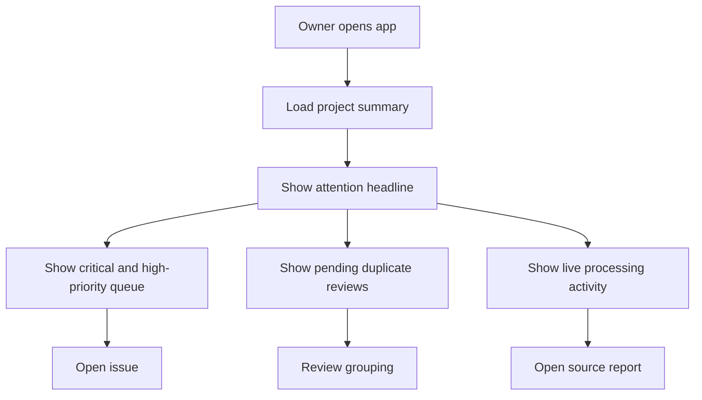

### Overview content order

1. Attention headline
2. Critical/high issues
3. Pending grouping decisions
4. Live processing
5. Recently resolved

### Empty overview

> Nothing needs attention right now.

Actions:

- Copy feedback link
- Submit test feedback

### Overview interaction rules

- Clicking a priority item opens issue detail.
- Clicking a processing event opens source report.
- New critical items announce through `aria-live`.
- Do not auto-reorder while the owner is using a keyboard-selected row; stage updates safely.

---

## 8. Owner Inbox Flow

The inbox is report-centric.

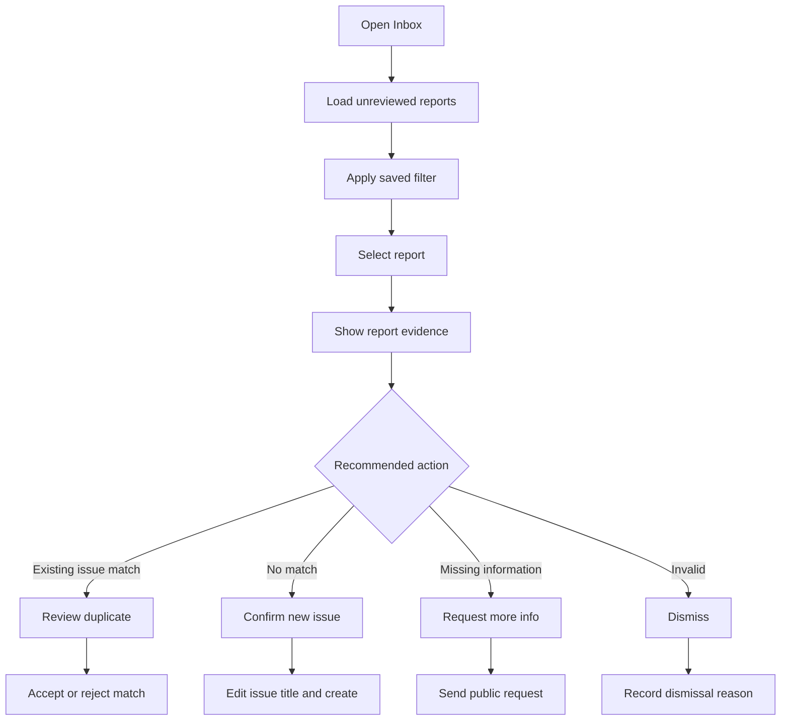

### Inbox filters

MVP:

- All
- Unreviewed
- Possible duplicates
- Processing failed
- Needs information
- Has screenshots

Advanced query builder is out of scope.

### Inbox report row

Shows:

- severity;
- normalized title;
- original excerpt;
- product area;
- browser/device;
- time;
- screenshot;
- processing state; and
- candidate issue.

### Selected-report detail

Sections:

- Original report
- Expected behavior
- Screenshot
- Context
- AI classification
- Candidate issues
- Activity
- Owner actions

### Processing states

#### Pending

> Waiting to process

#### Processing

> Classifying and checking related issues

#### Failed

> Processing failed

Action:

`Retry`

The owner can still inspect original evidence when processing fails.

---

## 9. Duplicate Review Flow

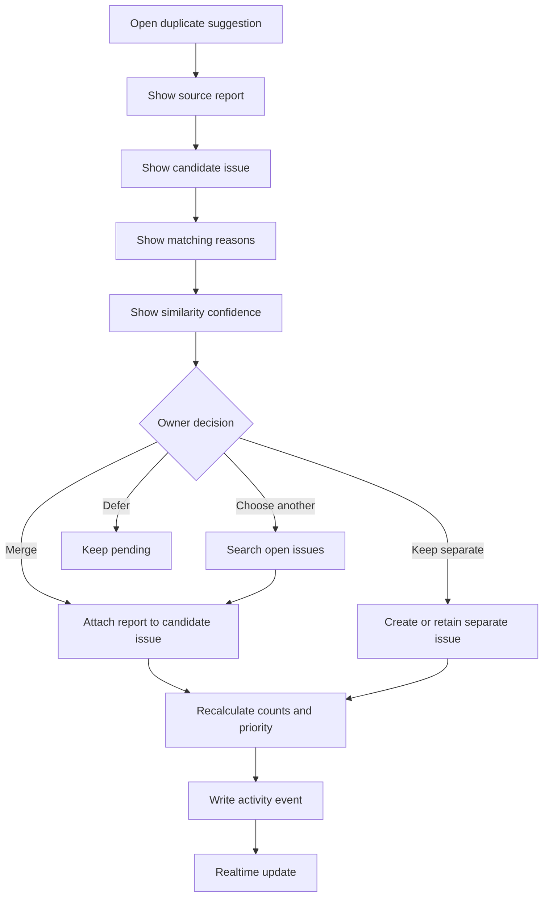

### Duplicate comparison layout

Desktop:

- Left: source report
- Right: candidate issue
- Bottom: reasons and actions

Mobile:

- Tabs: New report, Existing issue, Comparison
- Sticky action bar

### Required explanation

- matching product area;
- shared concepts;
- page overlap;
- environment overlap;
- confidence; and
- conflicting evidence.

### Merge confirmation

> This report will become the fourth report linked to FI-7K2M9A. Priority is expected to increase from 64 to 69.

---

## 10. Issue List Flow

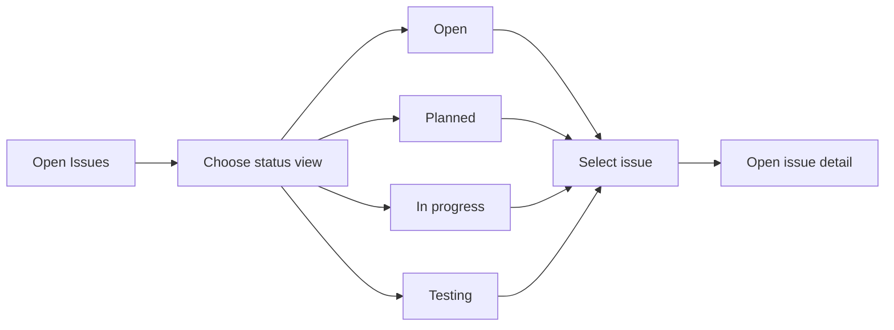

### List controls

- Search
- Status segmented control
- Severity filter
- Product-area filter
- Sort:
  - Priority
  - Most reports
  - Recently active
  - Oldest

Default: `Priority`

### Issue row

- issue ID;
- title;
- severity;
- report count;
- affected users;
- current status;
- last activity; and
- priority-explanation preview.

---

## 11. Issue Detail Flow

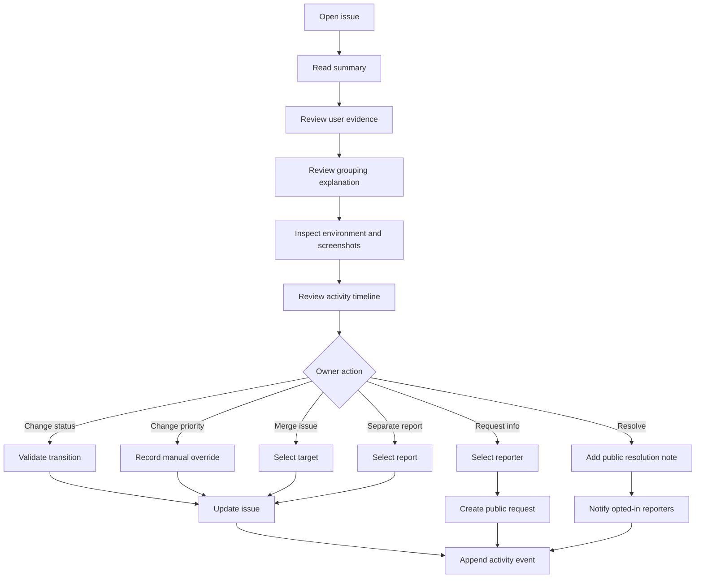

### Issue-detail screen anatomy

#### Header

- Issue ID
- Title
- Status
- Severity
- Report count
- Affected users
- First/last seen
- Primary actions

#### Executive summary

AI-generated but clearly labeled.

#### What users reported

Original source quotes.

#### Why grouped

Signals and confidence.

#### Environment

- Device
- Browser
- Page
- App version if supplied
- Report timeline

#### Attachments

Grid on desktop, horizontal gallery on mobile.

#### Reports

All linked reports with the ability to separate.

#### Activity

Append-only timeline.

#### Resolution

Public note and notification preview.

### Issue-detail acceptance criteria

- Owner can always reach original evidence.
- AI summary is distinguishable from source.
- Internal and public notes are separate.
- Merge/unmerge is reversible.
- Signed screenshot URLs can refresh when expired.
- Status-transition failure does not erase drafted note.

---

## 12. Status Change Flow

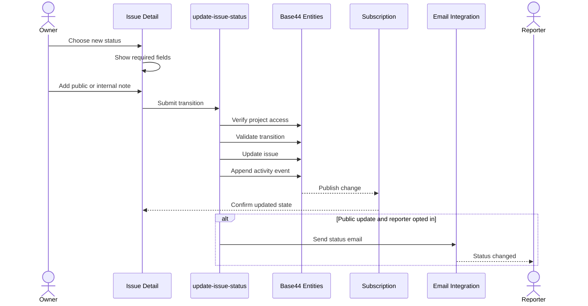

### Transition-specific requirements

- `Needs info`: requires a public question.
- `Resolved`: requires a public resolution note.
- `Dismissed`: requires an internal reason; public note optional.
- `Duplicate`: requires a target issue.
- `Reopened`: preserves prior resolution history.

---

## 13. Reporter Tracking Flow

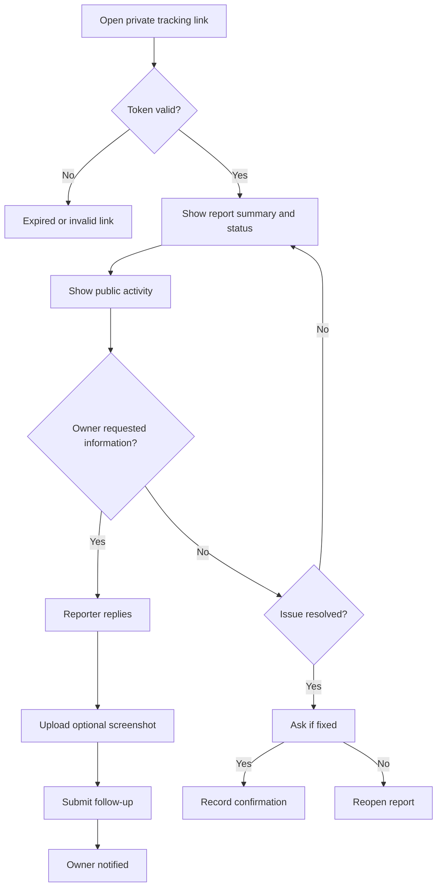

### Tracking-page content

Safe fields only:

- report reference;
- original reporter text;
- issue title;
- current status;
- public owner updates;
- request for information;
- follow-up form; and
- resolution confirmation.

Never show:

- other reporters’ emails;
- internal notes;
- project analytics;
- private matching scores not intended for reporter; or
- owner-only screenshots from other reports.

---

## 14. Settings Flow

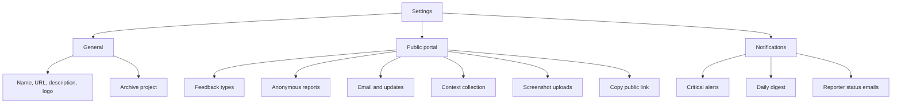

Do not include integrations or billing in the competition MVP.

---

## 15. Responsive Owner Flows

### Desktop ≥ 1100px

```text
Left rail | List/queue | Evidence/detail
```

Behavior:

- selected report remains highlighted;
- detail updates without losing list scroll;
- URL changes to preserve selection; and
- right panel may widen for screenshots.

### Tablet 768–1099px

```text
Collapsible rail | Main list
                     ↓
                 Slide-over detail
```

### Mobile < 768px

```text
Bottom navigation
Single list
Full-screen detail route
Sticky action bar
```

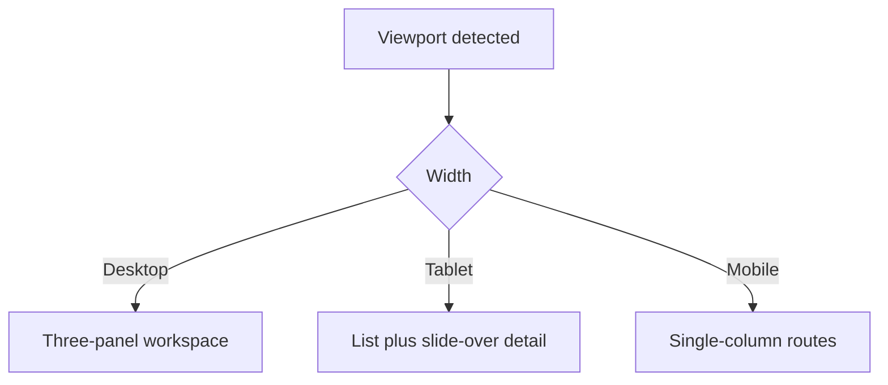

---

## 16. Mobile Public Form Flow

Mobile is the primary reporter surface.

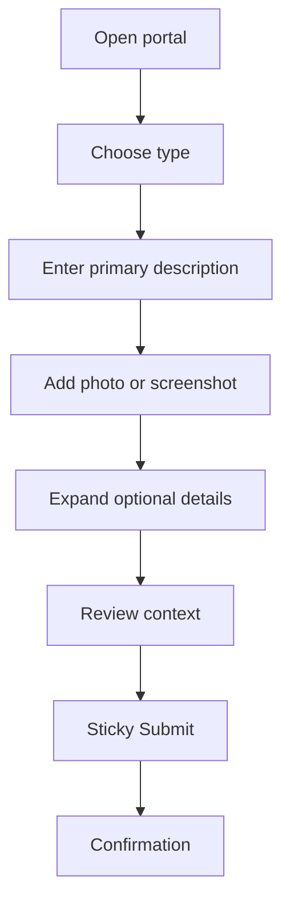

Mobile requirements:

- no horizontal scrolling;
- 44px controls;
- native file picker;
- textarea does not hide behind keyboard;
- sticky submit appears only when useful;
- browser back preserves form; and
- error summary scrolls to field.

---

## 17. Realtime Interaction Flow

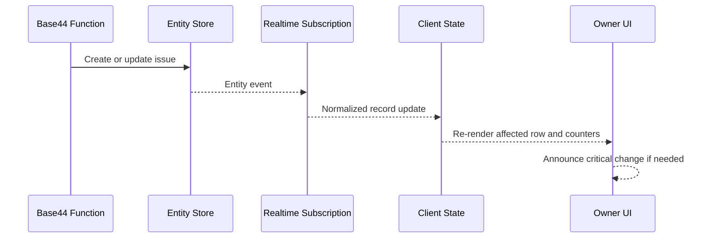

### Realtime UX rules

- Do not show a toast for every ordinary report.
- Show inline movement and count updates.
- Use toast only for critical events, failed actions, or owner-requested background completion.
- Preserve selected item.
- Avoid sudden list jumps while user is reading.
- Show a small `New updates` control when automatic reordering would be disruptive.

---

## 18. Loading and Processing Flow

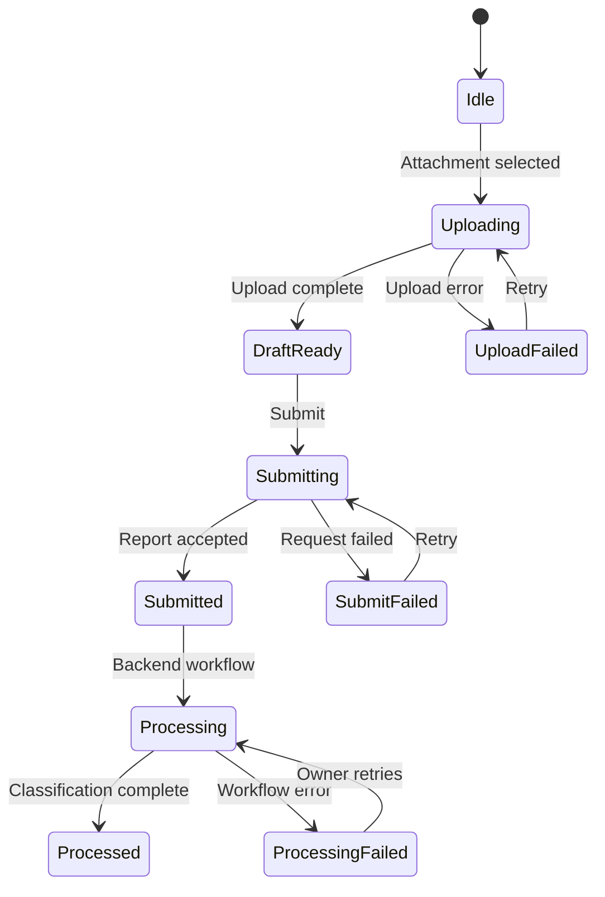

Reporter sees only through `Submitted`. Owner sees processing states.

---

## 19. Notification Flows

### Critical owner alert

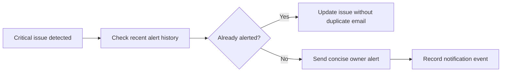

### Reporter update

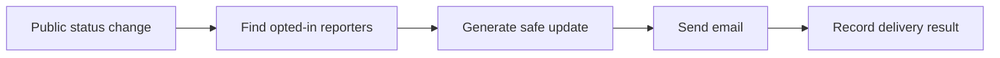

---

## 20. Screen Inventory

### Marketing

1. Landing
2. Demo

### Authentication and onboarding

3. Sign up / sign in
4. Create project
5. Feedback settings
6. Share portal

### Owner

7. Overview
8. Inbox
9. Report detail
10. Duplicate comparison
11. Issues
12. Issue detail
13. Resolved
14. Project settings

### Reporter

15. Portal entry
16. Bug form
17. Feature form
18. General form
19. Submission confirmation
20. Tracking page

Several screens share one route and shell. The competition does not require 20 independent visual designs.

---

## 21. Component-to-Screen Map

| Component | Screens |
|---|---|
| App shell | All owner screens |
| Public project header | Portal and tracking |
| Feedback-type card | Portal |
| Feedback-form shell | Bug, feature, general |
| Private file uploader | Forms and reporter follow-up |
| Context disclosure | Forms |
| Report row | Inbox |
| Report-evidence panel | Inbox and issue detail |
| Duplicate comparison | Inbox and issue detail |
| Issue row | Overview, issues, resolved |
| Issue header | Issue detail |
| Evidence quote | Issue detail |
| Grouping explanation | Issue detail |
| Environment breakdown | Issue detail |
| Activity timeline | Report and issue detail |
| Tracking status card | Tracking |
| Empty state | All lists |
| Processing indicator | Inbox and report detail |

---

## 22. Competition Build Order

### Day 1 — Foundation and public form

- Create fresh Base44 project.
- Define core entities.
- Set up owner authentication.
- Create project onboarding.
- Build public portal and text submission.
- Create owner inbox showing raw reports.

### Day 2 — Processing

- Implement `submit-feedback`.
- Implement `process-feedback`.
- Create issues and activity events.
- Add deterministic priority.
- Add processing states and retry.

### Day 3 — Duplicate grouping

- Candidate retrieval.
- Structured similarity.
- Automatic grouping.
- Owner duplicate review.
- Merge and unmerge.
- Seed demo reports.

### Day 4 — Issue workflow and realtime

- Issue detail.
- Status transitions.
- Reporter tracking.
- Realtime subscriptions.
- Critical owner alert.

### Day 5 — Screenshots and design system

- Private upload.
- Signed attachment viewing.
- Apply design tokens.
- Desktop workspace.
- Mobile public flow.

### Day 6 — PWA, accessibility, reliability

- Manifest and app shell.
- Draft preservation.
- Offline states.
- Keyboard support.
- Security testing.
- Automation deployment testing.

### Day 7 — Demo and submission

- Polish loading and empty states.
- Verify responsive breakpoints.
- Run exact demo repeatedly.
- Record walkthrough.
- Complete competition submission.
- Keep app deployed for judging.

Adjust dates to remaining competition time. Prioritize a stable demo over every listed screen.

---

## 23. First Implementation Slice

Build one vertical slice before creating the full dashboard:

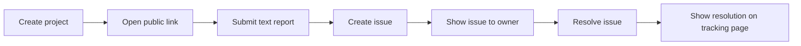

Only after this works should the team add screenshots, duplicate grouping, realtime, alerts, and PWA polish.

This prevents a beautiful frontend with no reliable backend loop.

---

## 24. Demo Data

Create one sample project:

```text
Product: TrailVerse Demo
Environment: Production
Feedback URL: /f/trailverse-demo
```

Seed candidate issue:

```text
FI-7K2M9A
Chat messages use incorrect width on mobile
Status: Open
Severity: High
```

Demo reports:

1. “My outgoing chat bubble is centered and leaves too much empty space on iPhone.”
2. “Messages do not use the screen width in mobile Safari.”
3. “The chat layout looks broken after the latest update.”
4. Unrelated control: “Weather page takes too long to load.”

Expected:

- first three group; and
- fourth creates another issue.

---

## 25. UX Test Scenarios

### Reporter

1. Submit text-only bug.
2. Submit screenshot bug.
3. Remove captured page URL.
4. Lose network while submitting.
5. Retry preserved draft.
6. Open private tracking link.
7. Respond to information request.
8. Confirm a resolution did not fix the issue.

### Owner

1. Create first project.
2. Copy public link.
3. Receive report in real time.
4. Inspect original evidence.
5. Accept suggested duplicate.
6. Reject incorrect duplicate.
7. Unmerge a report.
8. Retry failed processing.
9. Mark issue resolved.
10. Verify reporter tracking update.

### Security

1. Use another owner account to request the project.
2. Try listing public reports without auth.
3. Use expired tracking token.
4. Use tracking token for another report.
5. Open expired screenshot signed URL.
6. Submit unsupported attachment.

---

## 26. Screen Definition Template

For each screen built, record:

```text
Screen:
Route:
Primary user:
Primary goal:
Entry points:
Main content:
Primary action:
Secondary actions:
Loading state:
Empty state:
Error state:
Mobile behavior:
Accessibility:
Backend calls:
Realtime subscriptions:
Analytics events:
Acceptance criteria:
```

Use this template in implementation notes. Do not create a separate planning document for every screen unless necessary.

---

## 27. Product Analytics Events — Post-MVP Friendly

```text
project_created
feedback_portal_opened
feedback_type_selected
attachment_uploaded
feedback_submitted
tracking_link_copied
report_processing_completed
report_processing_failed
duplicate_suggested
duplicate_accepted
duplicate_rejected
report_unmerged
issue_status_changed
issue_resolved
reporter_follow_up_submitted
resolution_confirmed
issue_reopened
```

Do not let analytics delay the competition MVP.

---

## 28. UX Acceptance Checklist

### Public portal

- Product purpose is clear in five seconds.
- Feedback type is keyboard selectable.
- Description is the first meaningful field.
- Context collection is transparent.
- Screenshot preview is removable.
- Error does not erase data.
- Confirmation provides a private tracking link.

### Owner inbox

- New reports are visible.
- Processing state is clear.
- Original evidence is one click away.
- Duplicate recommendation explains itself.
- Owner can correct the system.

### Issue detail

- Report count and affected users are distinct.
- Original quotes are visible.
- Screenshot access is secure.
- Grouping reasons are visible.
- Priority explanation is visible.
- Status and resolution controls are clear.

### Responsive

- Public form works at 320px width.
- Mobile keyboard does not cover CTA.
- Owner detail is usable as a full-screen route.
- Desktop list retains context.
- Tablet layout avoids cramped three-column UI.

### Accessibility

- Focus is never trapped unintentionally.
- Live updates are announced appropriately.
- Severity includes text.
- Reduced motion is respected.
- Errors link to invalid fields.

---

## 29. Final Competition Flow

```mermaid
journey
    title VensaOS competition experience
    section Reporter
      Opens one feedback link: 5: Reporter
      Describes a problem: 5: Reporter
      Adds a screenshot: 4: Reporter
      Submits without an account: 5: Reporter
    section Base44 backend
      Validates and stores report: 5: System
      Classifies the feedback: 5: System
      Finds related issues: 5: System
      Groups duplicates and updates priority: 5: System
    section Product owner
      Sees live dashboard update: 5: Owner
      Reviews original evidence: 5: Owner
      Confirms or reverses grouping: 5: Owner
      Resolves the issue: 5: Owner
    section Reporter follow-up
      Tracks status privately: 5: Reporter
      Receives the resolution: 5: Reporter
```

---

## 30. Start Here

Implementation should begin with:

1. `Project`
2. `FeedbackSubmission`
3. `Issue`
4. `IssueReport`
5. `ActivityEvent`
6. `ReporterAccess`
7. `submit-feedback`
8. Public bug form
9. Owner inbox
10. Direct report-to-issue processing

The first milestone is not a landing page.

The first milestone is:

> A real public report enters Base44, becomes an issue, appears in the owner interface, is resolved, and updates a private reporter tracking page.
